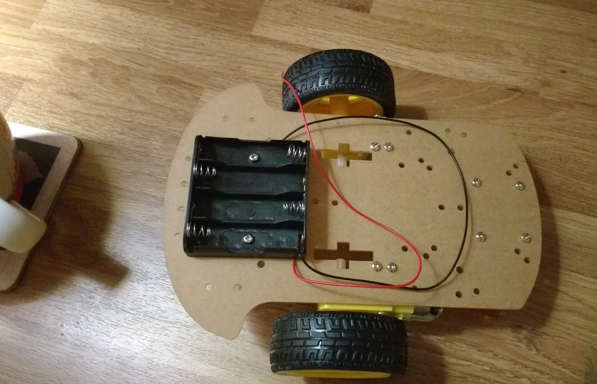
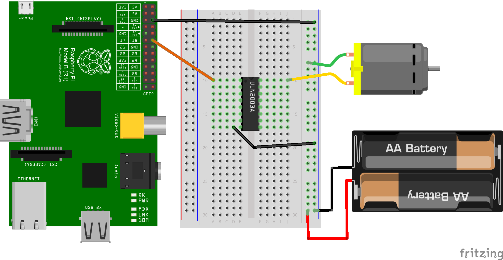

# Pi Remote CAR

This is a DIY project for a Pi Car hobbyist (estimated build time - 1 week)

## Architecture


## Step 1: Get a Chassis and Build it (2-4 hours)

Remote Car usin Sain smart chassis and can be bought on Amazon or SainSmart website http://www.sainsmart.com/ for about £6

### Before


### After



## Step 2: Wire up (2-4 hours)

Hook up to a motor board to control the wheels. 

Starting with the a breadboard to write the motor functions (with design from fritzing)



## Step 3: Connect Pi and other sensors

TODO Hook up a Pi Zero to control as main processing unit and control of other cars components 

## Step 4,5,6,7 TODO
* Add camera and Tensorflow for AI and image recongnition (http://elinux.org/RPi-Cam-Web-Interface)
```
    git clone https://github.com/silvanmelchior/RPi_Cam_Web_Interface.git
    cd RPi_Cam_Web_Interface
    chmod u+x *.sh
    ./install.sh
```
* Add Web Interface
 * install Nginx
 * Build a simple Python webserver
* Add Sensors for Collision avoidance
 * 
* Add Temperature Sensors to follow heat signatures
